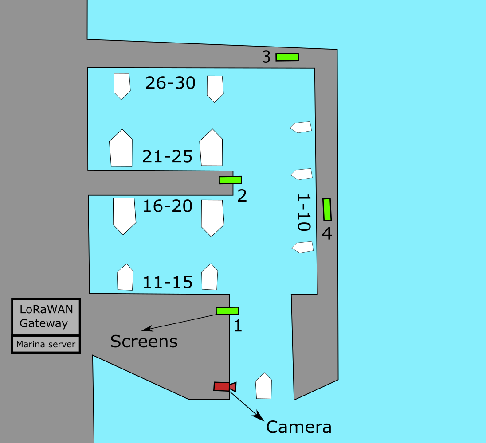

# Concept

The concept behind this project is to simplify the docking operation of amateur sailors when entering in a marina they never visited. Based on what different sailors reported, a very common problem during holiday cruises is the docking procedure. In many cases the indications to reach the correct docking spot are given via radio or orally in a very unpractical way. For example an information like "pier G, spot 14" is not easy to be used if the sailor doesn't know the place. This impractical method creates also a safety problem for example in summer when the marina canals are crowded by the boats of a lot of tourists.

The solution that we propose simplifies the docking operation for the sailors and the docking spot assignment problem for the marina workers with the introduction of an IoT system to be added to the marina. When an entering boat is detected the system automatically identifies the license plate of the boat with a camera and checks in a database if there is a reservation associated to that boat. Based on the boat details present in the reservation (e.g. length and width) the cloud systems assigns a free docking spot to the boat and generate a path in the marina canals to reach it. Then the low level information about the direction to follow are passed to some LCD screens present in the marina intersections which will indicate to each boat which path to follow (e.g. "boat VE5984  turn left; boat LV9484 turn right"). Then in the correct docking spot there is a LED flashing indicating the assigned slot. When a boat reaches its destination an ultrasonic sensor communicates to the system that the indications for that spots can be deleted.

An additional feature present inside the marina is a pollution monitoring. In particular, when some water quality sensors detect in some regions of the marina a dangerous level of sea pollution, an alert message is send to the marina manager. Then the smart docking spots assignation will be automatically adapted to reduce the number of boats stopping and passing in the polluted region.

## Personas

To make things more clear here we describe two personas who can benefit from this system.

### Amateur sailor

John is an amateur sailor who like to spend holidays on his boat cruising with his family. They like to explore the beauty of the coasts stopping every night in a different marina. John is very happy when the marina he has to reach has a smart signage system because in this way he can easily and safely reach the assigned docking spot after a long sailing day.

### Marina worker

Scott is a worker of a touristic marina and it's job is to coordinate the reservations of the tourists that want to stop in the marina. Since it was introduced the new signage system his work has become more simple and organized. Every day Scott checks the reservations made online and adds the ones received by phone, he looks at the marina entrance and simply checks that each boat reaches the assigned spot. He is so happy that during summer he doesn't have to go crazy signaling to all the incoming boats what to do inside the marina.

## Storyboard

Here we explain with a simple storyboard how the interaction with the signage system can be.

- A tourist sailor is approaching a marina where he booked for docking for the night.
- He follows the buoys indicating the entrance where a camera identifies his boat.
- He sees appearing on the LCD screen in front of him the license plate of his boat with the indication "turn right".
- He follows the indication and the following ones he sees on the screens.
- Finally he sees a free docking spot with a LED flashing and he safely docks there.

### Marina examples

The demo of the project is based on this marina.
There are 4 monitor and 30 docks. 
In the video presentation, the boat will dock on the spot 14 and the showed monitor is monitor number 3.
So the monitor 3 have to show the turn around sign.