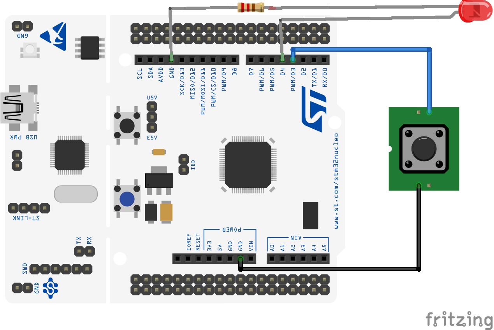

## HARDWARE WIRING



In the prototype the light is replaced with a small led and to detect if a boat is present
is used an ultrasonic range meter.

## HOW TO BUILD

To build a version compatible with ETHOS run this command
```
make ETHOS=1
```
this version by default has dock_id 13 and automatically setup TAP on your pc

Without ETHOS=1 parameter will build a version with 6LoWPAN connection
```
make ETHOS_BAUDRATE=500000 DEFAULT_CHANNEL=17
```
You have to use the same channel of the [border router](https://github.com/RIOT-OS/RIOT/tree/master/examples/gnrc_border_router)

Once the application is launched, you have to connect to the MQTTS broker, entering
this command in the serial interface (only in the 6LoWPAN version)

```
connect <ip_address_of_mqtts_broker> <node_id>
```
Building with the option `FAKE=1` the boat detection sensor output will be replaced with dummy random data.
You can use these options together, ex.
```
make ETHOS=1 FAKE=1
```

## NETWORK INTERFACE

For the tests with real hardware the nucleo board is connected to the internet connection of the pc using ETHOS.

For the network tests with IoT-Lab the board will be replaced with a IoT-Lab m3 that has a 6LoWPAN connection.

## MQTT TOPICS
The messages if a boat is detected or not are published in the topic `dock/boat` with this format
```
{
  "dock_id": 13,
  "detected": 0
}
```
`dock_id` identify the sender.

`detected` if it is 1 there is a boat in the dock, 0 otherwise

To toggle the light, the device is subscribed to the topic `dock/led` and accepts messages with
this format
```
{
"dock_id": 13,
"state":1
}
```
`dock_id` identify the receiver.

`state` if it is 0 the led will turn off, otherwise will be turn on